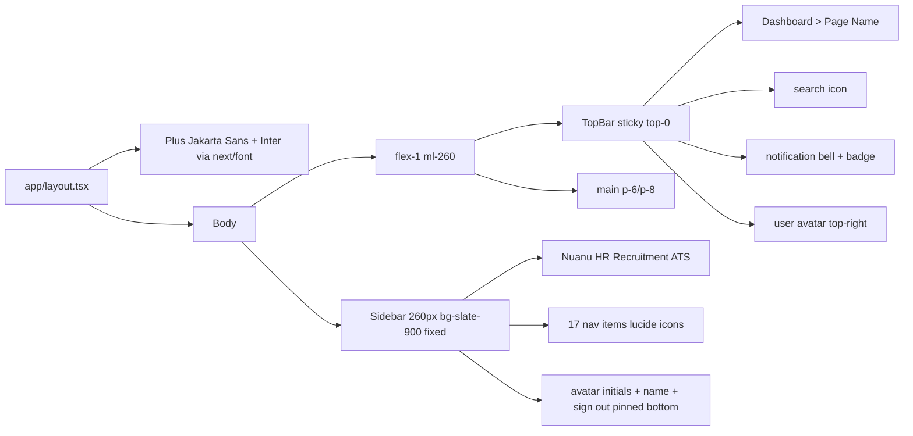

# Nuanu HR Recruitment ATS — Frontend Prototype Architecture

> **Scope:** Frontend-only visual prototype. No backend, no DB, no auth, no real API. All data is hardcoded mock arrays. Goal: preview UI/UX before porting into the real app.

---

## 1. Tech Stack & Versions

| Concern | Choice |
|---|---|
| Framework | Next.js 14 (App Router) |
| Language | TypeScript (strict) |
| Styling | Tailwind CSS v3 (classic `tailwind.config.ts` + PostCSS) |
| Icons | `lucide-react` |
| Charts | `recharts` |
| Classnames | `clsx` + `tailwind-merge` (via `cn` helper) |
| Fonts | `next/font/google` — Plus Jakarta Sans (headings) + Inter (body) |
| Scaffold | `create-next-app@14 --ts --tailwind --app --no-src-dir --import-alias "@/*"` |
| Project dir | `app/` at root (no `src/`) |

---

## 2. Design System (single source of truth)

### 2.1 Brand Colors
- **Primary teal:** `#006b5f` → exposed as Tailwind token `brand` (with `50..900` scale; `600` = `#006b5f`).
- **Light teal accent:** `#e6f5f3` → `brand-50` / used for hover/active/badge backgrounds.
- **Primary hover:** `#005248` → `brand-700`.

### 2.2 Neutral Palette
- White backgrounds (`bg-white`).
- Borders: `border-slate-200` (`#e2e8f0`).
- Body text: `text-slate-600` (`#475569`).
- Muted text: `text-slate-400` (`#94a3b8`).
- Sidebar: `bg-slate-900`.

### 2.3 Typography
- **Headings/titles:** Plus Jakarta Sans (`font-heading`).
- **Body/UI:** Inter (`font-sans`, default).
- Page title: `text-2xl font-bold font-heading`.
- Section title: `text-lg font-semibold`.
- Body: `text-sm text-slate-600`.
- Label: `text-xs font-medium uppercase tracking-wide text-slate-400`.

### 2.4 Cards
`bg-white rounded-2xl border border-slate-200 shadow-sm p-6`. Min gap-6 between cards. Nothing edge-to-edge (page padding `p-6`/`p-8`).

### 2.5 Buttons (`h-11 rounded-lg`, icon+label `gap-2`)
- **Primary:** `bg-[#006b5f] text-white hover:bg-[#005248]`.
- **Secondary:** `bg-white border border-slate-300 text-slate-700 hover:bg-slate-50`.
- **Destructive:** `border border-red-300 text-red-600 hover:bg-red-50`.

### 2.6 Tables
- Row min-height 56px (`py-4`).
- Avatar circle (initials, teal bg) + name + subtext per row.
- Status = colored pill (`rounded-full px-3 py-1 text-xs font-medium`).
- Action icons right-aligned, `gap-2`, `hover:bg-slate-100 rounded`.
- Sticky header: `bg-slate-50`, uppercase tracking-wide `text-xs text-slate-400`.

### 2.7 Status Pill Colors
| Status | BG | Text |
|---|---|---|
| New | blue-100 | blue-700 |
| Screening | purple-100 | purple-700 |
| Interview | amber-100 | amber-700 |
| Offer | teal-100 | teal-800 |
| Hired | green-100 | green-700 |
| Rejected | red-100 | red-700 |
| Talent Bank | slate-100 | slate-600 |

### 2.8 Forms
- Label: `text-xs font-medium text-slate-500 mb-1.5`.
- Input: `h-11 rounded-lg border border-slate-300 focus:border-[#006b5f] focus:ring-2 focus:ring-[#006b5f]/20 px-3`.

### 2.9 Empty States
Centered icon in `bg-[#e6f5f3]` soft teal circle → bold headline → muted subtext → primary CTA button.

---

## 3. Folder Structure

```
/
├── app/
│   ├── layout.tsx                 # Root: fonts + Sidebar + TopBar shell
│   ├── globals.css                # Tailwind base + font vars
│   ├── page.tsx                   # / Dashboard
│   ├── jobs/page.tsx
│   ├── approvals/page.tsx
│   ├── candidates/
│   │   ├── page.tsx               # /candidates list
│   │   ├── [id]/page.tsx          # candidate detail
│   │   └── compose/page.tsx      # email compose
│   ├── pipeline/page.tsx
│   ├── talent-bank/page.tsx
│   ├── ai-scoring/page.tsx
│   ├── interviews/
│   │   ├── page.tsx
│   │   └── schedule/page.tsx
│   ├── assessment/
│   │   ├── page.tsx
│   │   └── send/page.tsx
│   ├── offers/
│   │   ├── page.tsx
│   │   └── generate/page.tsx
│   ├── employees/page.tsx
│   ├── onboarding/page.tsx
│   ├── analytics/page.tsx
│   ├── reports/page.tsx
│   ├── notifications/page.tsx
│   └── settings/page.tsx
├── components/
│   ├── layout/
│   │   ├── Sidebar.tsx
│   │   ├── TopBar.tsx
│   │   └── AppShell.tsx          # optional wrapper
│   └── ui/
│       ├── Card.tsx
│       ├── MetricCard.tsx
│       ├── StatusPill.tsx
│       ├── Button.tsx
│       ├── Avatar.tsx
│       ├── EmptyState.tsx
│       ├── PageHeader.tsx         # title + subtitle + actions
│       ├── SearchInput.tsx
│       ├── Tabs.tsx
│       └── RadialGauge.tsx        # SVG circular gauge for AI match
├── lib/
│   ├── utils.ts                   # cn() helper
│   ├── nav.ts                     # sidebar nav config
│   └── mock-data.ts               # shared mock arrays
├── tailwind.config.ts
├── postcss.config.js
├── tsconfig.json
├── next.config.mjs
└── package.json
```

---

## 4. Component Contracts

### `<Button variant="primary|secondary|destructive|ghost" size="sm|md|lg" icon={...}>`
Renders `<button>` with consistent height `h-11`, `rounded-lg`, icon+label `gap-2`. `onClick` optional (logs to console in prototype).

### `<Card className title? actions?>`
`bg-white rounded-2xl border border-slate-200 shadow-sm p-6`. Optional header row with title + right-aligned actions.

### `<MetricCard icon label value trend={{value, direction}} />`
Icon top-left (in teal-50 circle), big number, muted label, trend arrow top-right (green up / red down).

### `<StatusPill status="New|Screening|Interview|Offer|Hired|Rejected|Talent Bank" />`
Maps status → pill color pair from §2.7.

### `<Avatar name src? size="sm|md|lg" />`
Circle with initials derived from name, `bg-[#006b5f] text-white`. Falls back to initials if no src.

### `<EmptyState icon title description ctaLabel onCta />`
Centered layout per §2.9.

### `<PageHeader title subtitle breadcrumb actions />`
Used at top of every page (in addition to TopBar). Renders title + optional subtitle + right-aligned action slot.

### `<RadialGauge value={0-100} size label />`
Pure SVG circular progress ring (teal track). Used in AI Scoring + candidate profile.

### `<Tabs tabs={[{id,label}]} active onChange />`
Underline-style tab nav reused on candidate profile, employees panel, assessment, analytics.

---

## 5. Layout Shell



### Sidebar nav items (in order)
Dashboard, Jobs & Vacancies, Approvals, Candidates, Pipeline, Talent Bank, AI Scoring, Interviews, Assessment, Offers, Employees, Onboarding, Analytics, Reports, Notifications, Settings. Active item: `bg-[#006b5f] text-white`.

---

## 6. Route Map (18 routes)

| # | Route | Key elements |
|---|---|---|
| 1 | `/` | 6 metric cards, sourcing bar chart (recharts), channel table, diversity bars + funnel |
| 2 | `/jobs` | requisition card grid (3/row), search+filters, Create Vacancy |
| 3 | `/approvals` | job info card, 3-step approval chain, decision card w/ textarea |
| 4 | `/candidates` | full data table, search, stage filter, Upload/Export |
| 5 | `/candidates/[id]` | profile header, 7-tab nav, Profile Overview + AI gauge |
| 6 | `/pipeline` | kanban, 7 columns, draggable-looking cards |
| 7 | `/talent-bank` | table, subtitle, filtered mock |
| 8 | `/ai-scoring` | Intelligence Engine badge, radial gauge cards, Shortlist/Analysis |
| 9 | `/interviews` | upcoming interview cards |
| 10 | `/interviews/schedule` | full-page 2-col form + sticky summary |
| 11 | `/assessment` | stats cards, tabs, table |
| 12 | `/assessment/send` | full-page form + pass-threshold slider card |
| 13 | `/offers` | offers table |
| 14 | `/offers/generate` | full-page form + sticky summary |
| 15 | `/employees` | table + right detail panel w/ tabs |
| 16 | `/onboarding` | 4 metric cards, search, empty state |
| 17 | `/analytics` | date-range tabs, 4 metrics, sourcing chart + mini cards, table |
| 18 | `/reports` | report type card grid |
| 19 | `/notifications` | All/Unread tabs, notification cards |
| 20 | `/settings` | left sub-nav, Integrations stack cards |
| 21 | `/candidates/compose` | full-page email compose |

> Note: routes 10, 12, 14, 18(compose) are full-page flows (not modals) per spec.

---

## 7. Mock Data Strategy

`lib/mock-data.ts` exports typed arrays shared across pages:
- `mockCandidates` (10 Indonesian names, email, source, stage, aiMatch, appliedDate, position)
- `mockJobs` (title, dept, type, candidateCount, hireProgress, status, seekBadge)
- `mockEmployees` (name, position, dept, status, contact)
- `mockNotifications` (title, desc, timestamp, read, type)
- `mockInterviews`, `mockOffers`, `mockAssessments`, `mockReports`
- Status type union reused by `<StatusPill />`.

Pages may also define page-local mock arrays when data is page-specific (e.g. dashboard metrics, analytics series).

---

## 8. Implementation Order

1. **Phase 1 — Setup:** scaffold, install deps, Tailwind config, fonts, globals.
2. **Phase 2 — Foundation:** `lib/utils.ts`, `lib/mock-data.ts`, `lib/nav.ts`, all `components/ui/*`, `Sidebar`, `TopBar`, root `layout.tsx`.
3. **Phase 3 — Routes:** build all 21 route files in one pass using shared components + mock data.
4. **Phase 4 — Verify:** `npm run dev` (server starts clean) + `npm run build` (no TS errors).

---

## 9. Conventions

- All page components are server components by default; add `"use client"` only where interactivity is required (kanban drag-look, employee detail panel state, tabs, sliders, toggles).
- No real form submission — `onClick` handlers log to console or are no-ops.
- Responsive: mobile-friendly but optimized for desktop ≥1280px.
- Every screen reuses shared components — no one-off card/button markup.
- Indonesian names used in mock data (e.g. Budi Santoso, Siti Nurhaliza, Andi Wijaya, Dewi Lestari, Rizki Pratama, Putri Maharani, Agus Setiawan, Maya Sari, Fajar Hidayat, Indah Permatasari).
